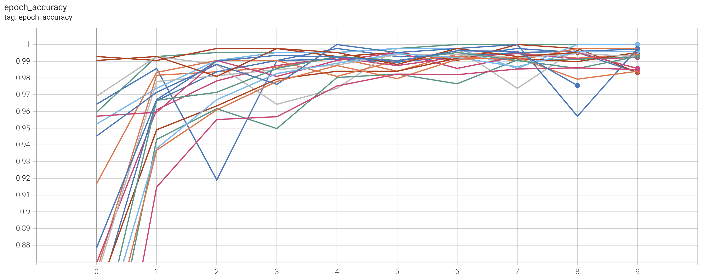
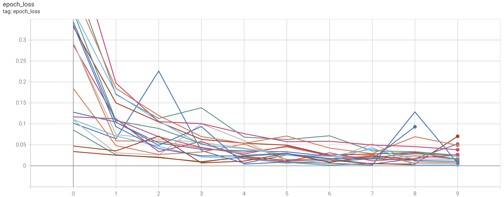
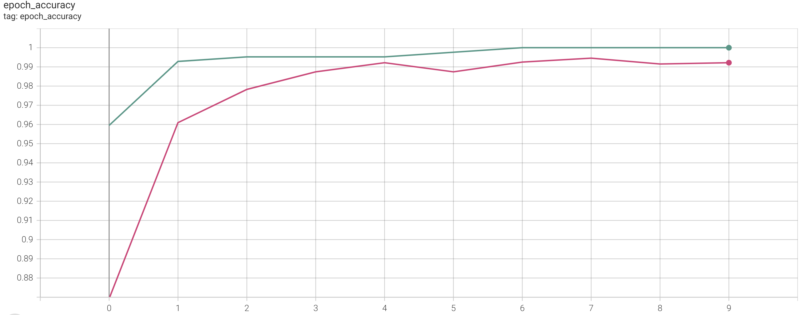
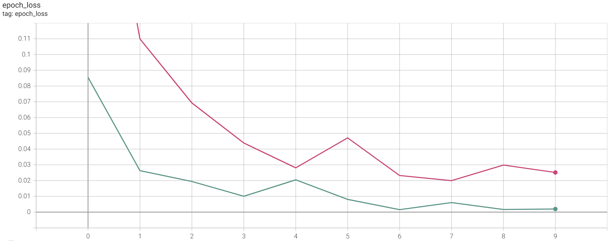
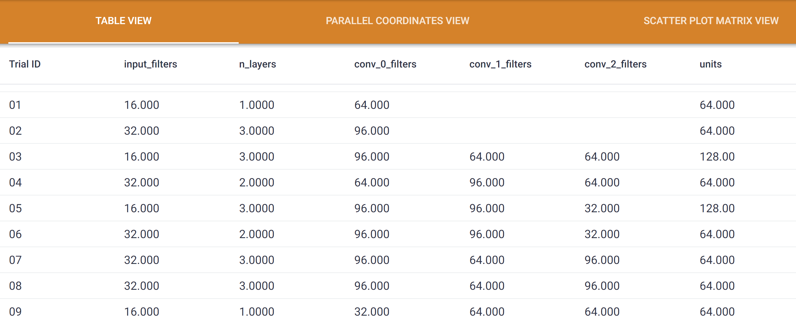
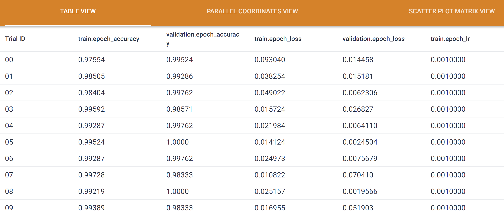
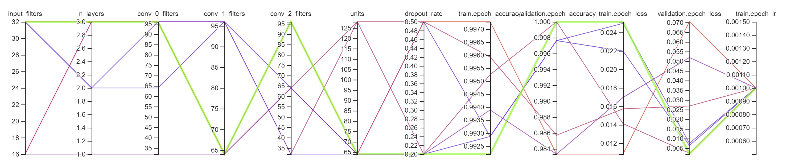

# Powdery Mildew Detector

[The **Live Application** can be found here](https://mildew-detection-vjp-e70ca88c0216.herokuapp.com/)

## Contents

1. [Development Process](#1-development-process)
2. [Dataset Content](#2-dataset-content)
3. [Business Requirements](#3-business-requirements)
4. [Hypothesis and how to validate?](#4-hypothesis-and-how-to-validate)
5. [The rationale to map the business requirements to the Data Visualisations and ML tasks](#5-the-rationale-to-map-the-business-requirements-to-the-data-visualisations-and-ml-tasks)
6. [ML Business Case](#6-ml-business-case)
7. [Hypothesis Validation and Conclusions](#7-hypothesis-validation-and-conclusions)
8. [Model Design](#8-model-design)
9. [Dashboard Design (Streamlit App User Interface)](#9-dashboard-design-streamlit-app-user-interface)
10. [Bugs](#10-bugs)
11. [Deployment](#11-deployment)
12. [Main Data Analysis and Machine Learning Libraries](#12-main-data-analysis-and-machine-learning-libraries)
13. [Credits](#13-credits)

## 1. Development Process

This project was developed using the Cross Industry Standard Process for Data Mining (CRISP-DM) workflow, as a set of  guidelines to plan and organise the project. CRISP-DM is a process model with six phases covering the full data science life cycle; business understanding, data understanding, data preparation, modelling, evaluation and deployment. 

### Phase 1: Business Understanding

The business objective relating to this project is to ensure the client will not supply the market with a product of compromised quality. The clients current process of identifying cherry trees with powdery mildew is not sufficient to reliably detect the presence of mildew across the whole plantation of crops. A quicker and more reliable method of identifying the presence of powdery mildew on cherry leaves would help the client reach their business objective and ensure their product is of high quality.

The business requirements were agreed upon with the client and will form the basis of the overall goals of this project. (See business requirements)

A successful project outcome from the perspective of the client would be for the project to produce the following:
* A study showing how to visually differentiate a cherry leaf that is healthy from one that contains powdery mildew.
* The capability to predict if a cherry leaf is healthy or contains powdery mildew.
* The performance of the predictions made have a degree of 97% accuracy.

The value of this project to the client would be a quicker and more reliable process for identifying powdery mildew in their cherry plantation crop, resulting in earlier treatment of the infected plants and reducing the likelihood of an inferior product being supplied to the market. Also, the resulting images of the study to visually differentiate a cherry leaf that is healthy from one that contains powdery mildew will help familiarise employees with the typical signs of mildew infection. There would be a reduced need for staff performing the mildew identifying process to have the expertise and experience required for the current manual verification process. However, relying solely on the system delivered by this project could result in misdiagnosis as the model could become invalid, for example if other factors affect the cherry crop, such as disease with similar visual signs. Continuous monitoring of the deployed projects performance will minimise the risk of invalid predictions.

The resources required for this project include:
* Data analysis software to process the data and analyse the performance of the system developed to satisfy business requirements. (See techs used)
* Development environment in which to analyse data and produce the required project deliverables. (See tech)
* Computing resources, such as sufficient GPU, capable of performing deep learning tasks.
* Sufficient labelled data. The data used in this project was provided by the client. Augmentation methods can be used to artificially expand the dataset.

### Phase 2: Data Understanding

The data provided by the client consists of 2104 images of healthy cherry leaves and 2104 mildew infected cherry leaves. The format of all files in the dataset is jpg. Data visualization techniques such as creating a montage of a subset of imaged of each label will help to start understanding the dataset. Visualizing examples from each label will help to become familiar with the data, and will give an initial idea of the quality and suitability of the data. Calculating the average and standard deviation from the array values of the images will highlight patterns and correlations in the data and help to verify the quality of the data. Studying the difference between the average images of each label can provide additional insight to how the labels differ from each other.

### Phase 3: Data Preparation

The data quality can be explored by checking for irrelevant, non-image data files. Data cleaning will remove any non-image data files from the dataset. The data will then be split into three subsets; a training set which will be used to train the model, a validation set which will be used to evaluate the model performance during training and a test set which will be used to evaluate the models performance post training. The image shape of the data will also be reduced to ensure model can be trained in a suitable timeframe. Augmentation of the data will artificially expand the dataset and provide additional data on which to train a machine learning model, helping to reduce the risk of overfitting the data.

### Phase 4: Modelling

Augmentation of the training image dataset using the Keras class ImageDataGenerator will increase the amount of data available for training the model by generating batches of images that are versions of existing images that have been augmented in various ways such as rotated, flipped and zoomed. Image augmentation increases the number of images with different combinations of patterns while training, giving the model a wider variety of data features to learn from, thus increasing model performance.

To begin the model design process an initial, simple model will be defined and its performance evaluated to provide a starting point for optimization using [KerasTuner](https://keras.io/keras_tuner/). Aspects of the architecture and the hyperparameters of the model will be defined dynamically during model building, resulting in a final optimized model. The tuning process can be visualized using [Tensorboard](https://www.tensorflow.org/tensorboard), a tool provided with TensorFlow that logs events such as metrics summary plots and training graph visualization. The final optimized model will be retrained and evaluated, then tested using the test dataset.

### Phase 5: Evaluation

The training history of the model can be evaluated by plotting the learning curves of the accuracy and loss metrics. This will show changes in learning performance over the course of the training process and indicate if the model is over-fitting, under-fitting or well-fit to the data set.

An evaluation of the model performance on a test set of data that the model has not seen before will give an indication of how well the model will perform in a real-world setting.

The model performance will also be evaluated using the following classification metrics to further analyse the model performance and the ways in which it fails and succeeds:
* Confusion matrix
* Classification report
* AUC - ROC curve

Finally, the model will be tested by making a prediction on images taken from the test set to check if the prediction matches the expected outcome.

### Phase 6: Deployment

The client has requested a dashboard and will access the delivered data study and ML system via a Streamlit application user interface that includes multiple pages for the results of the visual study, the classifier, model performance metrics and useful project information.

The results of the study to visually differentiate a cherry leaf that is healthy from one that contains powdery mildew will be displayed on a dedicated dashboard page including plots produced as part of the study and a brief statement detailing the conclusions of each plot.

The classifier page is required to enable the upload of sample images for classification, display the uploaded images and the prediction results as a prediction statement and probability associated with this statement and to produce a table with image name and prediction results that can be downloaded via a download button.

The model performance page will include plots displaying plots of performance metrics and a brief statements detailing the conclusions of each plot.

The dashboard will include a project summary page detailing the dataset used and the client's requirements, and a hypothesis page detailing the project hypotheses and validation methods.

The dashboard will be deployed with Heroku, a cloud platform used to deploy and monitor applications.

## 2. Dataset Content

* The dataset is sourced from [Kaggle](https://www.kaggle.com/codeinstitute/cherry-leaves). We then created a fictitious user story where predictive analytics can be applied in a real project in the workplace.
* The dataset contains +4 thousand images taken from the client's crop fields. The images show healthy cherry leaves and cherry leaves that have powdery mildew, a fungal disease that affects many plant species. The cherry plantation crop is one of the finest products in their portfolio, and the company is concerned about supplying the market with a compromised quality product.

## 3. Business Requirements

The cherry plantation crop from Farmy & Foods is facing a challenge where their cherry plantations have been presenting powdery mildew. Currently, the process is manual verification if a given cherry tree contains powdery mildew. An employee spends around 30 minutes in each tree, taking a few samples of tree leaves and verifying visually if the leaf tree is healthy or has powdery mildew. If there is powdery mildew, the employee applies a specific compound to kill the fungus. The time spent applying this compound is 1 minute.  The company has thousands of cherry trees, located on multiple farms across the country. As a result, this manual process is not scalable due to the time spent in the manual process inspection.

To save time in this process, the IT team suggested an ML system that detects instantly, using a leaf tree image, if it is healthy or has powdery mildew. A similar manual process is in place for other crops for detecting pests, and if this initiative is successful, there is a realistic chance to replicate this project for all other crops. The dataset is a collection of cherry leaf images provided by Farmy & Foods, taken from their crops.

* 1 - The client is interested in conducting a study to visually differentiate a healthy cherry leaf from one with powdery mildew.
* 2 - The client is interested in predicting if a cherry leaf is healthy or contains powdery mildew.

## 4. Hypothesis and how to validate?

1. The leaves of plants that contain powdery mildew have clear signs of infection, typically white powdery patches of fungus on the surface of the leaf, differentiating them from healthy leaves.
   * How to validate: Conventional data analysis can be used to conduct a study to visually differentiate a healthy cherry leaf from one that contains powdery mildew. An average image study and an image montage can be used in this investigation.

2. Using the ML system developed for this project, Farmy and Food's employee's will not need to have the botanical expertise needed to diagnose powdery mildew on cherry leaf samples to correctly identify infected trees.
   * How to validate: Neural Networks can be used to map the relationships between the features and the labels of a dataset containing images of known examples of healthy and mildew affected cherry leaves, and develop a binary classifier that will predict cherry leaf image classification over real-time data.

3. Reliable predictions can be made to determine if a given leaf contains powdery mildew or is healthy, with a degree of 97% accuracy.
   * How to validate: Performance metrics can be used to evaluate the performance of the ML model. Evaluating the model accuracy metric will confirm the degree of model accuracy. Classification performance metrics such as the confusion matrix, classification report can be used to evaluate the frequency with which the model correctly predicted the class of data in a test dataset.

## 5. The rationale to map the business requirements to the Data Visualisations and ML tasks

* **Business Requirement 1**: Data Visualisation
  The client is interested in conducting a study to visually differentiate a cherry leaf that is healthy from one that contains powdery mildew.

  * As a client I want to display the "mean" and "standard deviation" images for healthy cherry leaves and cherry leaves that contain powdery mildew.
  * As a client I want to display the differences between an average healthy cherry leaf and a cherry leaf with powdery mildew.
  * As a client I want to display an image montage for healthy cherry leaves and mildew-infested leaves.

* **Business Requirement 2**: Classification
  The client is interested in predicting if a cherry leaf is healthy or contains powdery mildew.
  
  * As a client I want to predict if a given cherry leaf is healthy or contains powdery mildew so that I do not supply the market with a product of compromised quality.
  * As a client I want to build a binary classifier to predict the class of the output variable, and generate model performance reports to evaluate the accuracy of the predictions made.

## 6. ML Business Case

* We want a ML model to predict if the cherry leaf tree is healthy or has powdery mildew. It is a supervised model, a 2-class, single-label, classification model.
* Our ideal outcome is to provide employees at Farmy & Foods  a tool for faster and more reliable diagnostic analysis for the detection of the powdery mildew on the cherry plantation crop, that can be easily replicated for use with all other crops grown by the business.
* The model success metrics are:
  * Accuracy of 97% or above on the test set.
* The model output is defined as a flag, indicating if the cherry leaf has mildew or not and the associated probability of being infected or not.  Farmy & Foods employees will take samples of tree leaves as usual, photograph the samples and upload the pictures to the App. The prediction is made on the fly (not in batches).
* Heuristics: The current diagnostic process is to manually verify if a given cherry tree contains powdery mildew. Taking samples of leaves and verifying visually if the leaf tree is healthy or has powdery mildew takes around 30 minutes per tree. The process requires the employee to have experience in identifying powdery mildew and due to human error there is the risk of inaccurate conclusions being made.
* The training data to fit the model comes from [Kaggle](https://www.kaggle.com/codeinstitute/cherry-leaves). It is a balanced dataset containing 4208 labelled images of cherry leaves divided into 2 subsets of healthy and mildew containing leaf images to be used for model training using supervised learning. The data format is .jpg files.
  * Train data - target: healthy or powdery mildew affected; features: all images.

## 7. Hypothesis Validation and Conclusions

**Hypothesis 1**: The leaves of plants that contain powdery mildew have clear signs of infection, typically white powdery patches of fungus on the surface of the leaf, differentiating them from healthy leaves.

Validation of hypothesis 1 was achieved using exploratory data analysis methods. The "mean" and "standard deviation" images for healthy cherry leaves and cherry leaves that contain powdery mildew were plotted using 30 images for each label. The pixel values were normalized and a plot for average image and a plot for variability in the images were created for both healthy and powdery_mildew labelled images.

A plot of the differences between an average healthy cherry leaf and a cherry leaf with powdery mildew was created by first calculating the mean image for each label and then calculating the difference between the mean images. A plot of the results of each calculation was created to provide a visual representation of the data at each stage of the process. The contrast between the labels is highlighted by the darker areas in the difference image and the similarities highlighted by the lighter areas.

An image montage for healthy cherry leaves and mildew-infested leaves was created using a subset of images of each label.

Conclusions:

* Studying the mean and variability of images per label highlighted that a mildew infected cherry leaves exhibit more variation across the surface of the leaf. However, the study did not highlight any distinct patterns that could be used to intuitively differentiate between healthy and infected leaves.
* Studying the difference between average healthy and average powdery mildew cherry leaves did not highlight patterns where we could intuitively differentiate one from another.
* The image montage can be used to visually identify differences between a healthy leaf and a mildew infected one, and highlight typical signs of mildew infection.

**Hypothesis 2**: Using the ML system developed for this project, Farmy and Food's employee's will not need to have the botanical expertise needed to diagnose powdery mildew on cherry leaf samples to correctly identify infected trees.

Validation of hypothesis 2 was achieved by creating a convolutional neural network that is capable of distinguishing between healthy and powdery mildew infected cherry tree leaves. The model requires users to provide only an image of a cherry tree leaf and will give a prediction of if the leaf is infected with mildew or not.

Conclusion:
The user does not need to provide any other information to the model, therefore does not any botanical expertise to successfully use the model.

**Hypothesis 3**: Reliable predictions can be made to determine if a given leaf contains powdery mildew or is healthy, with a degree of 97% accuracy.

Validation of hypothesis 3 was achieved using model performance and classification metrics.

Conclusions:

* The model learning curves suggest the model learned well as both the loss and accuracy plots for training and validation data follow a similar path and are close to each other.
* The evaluation of the model over the data test set gave a generalized loss of less than 1% and accuracy of more than 99%, which more than satisfies the clients requirement of 97% accuracy.
* The confusion matrix plot shows that when testing the model with the test set; 419 healthy leaves were correctly predicted to be healthy, 3 healthy leaves were incorrectly predicted to be mildew infected, and all 422 mildew infected leaves were correctly predicted to be mildew infected, no mildew infected leaves were incorrectly predicted to be healthy.
* Recall/sensitivity rate is the percentage of the class that was properly predicted. The classification report shows that 99.3% of the healthy leaf images were correctly predicted as healthy and 100% of the mildew infected leaf images were correctly predicted as infected.
* Precision is the percentage of predictions related to a class made were correct, or how many predictions of a certain class were correct compared to the total number of predictions of that class. The classification report shows that the 100% of the healthy class predictions made were correct and 99.3% of the powdery_mildew class predictions were correct.
* The f1-score measures Recall and Precision together using Harmonic Mean. It give the average value for Recall and Precision.
* ROC (Receiver Operating Characteristic) is a probability curve and is used to calculate the AUC (Area Under Curve) value. The AUC value represents the degree or measure of separability, which is the models capability to distinguish between classes. The AUC value achieved in this evaluation report shows that the model has a high capability to distinguish between classes.

## 8. Model Design

The model used in this project is a convolutional neural network(CNN), which is an example of a deep learning model. The CNN model is a regularized type of feed-forward neural network that learns feature engineering by itself via filters (or kernel) optimization. These filter enable convolutional networks to identify patterns in small sections of an image and later recognize that pattern in a different location of other images.

Keras was used to implement the model, this is a high-level neural networks API. It provides a user-friendly interface for creating and training neural networks using lower-level backends such as Tensorflow that enable fast computations.

To simplify the process of building the neural network model, the Keras sequential class was used. This is a linear stack of layers which enable the creation of neural network model layers in a step-by-step fashion.
Each layer added to the sequential model is connected to the previous one, forming a sequential chain. This makes it easy to create and understand simple models and is
particularly useful for building feedforward neural networks where information flows in one direction, from the input layer through the hidden layers to the output layer.

### Model Architecture

The CNN model uses convolution, pooling, flatten, dropout and fully connected layers. Activation functions are applied to determine if a neuron should be activated or not, this is done by calculating the weighted sum and adding bias to it. This introduces non-linearity to the output neuron and enables backpropagation of errors from the output to the input nodes. Backpropagation is achieved by comparing generated outputs to the desired output and generating an error report if they do not match. The weights are adjusted according to the report to get the desired output, helping the model to 'learn from its mistakes'.

Convolution layers are used to select the dominant pixel values from the non-dominant pixels in images using filters. The number of filters used is the dimensionality of the output space or the number of channels in the output of the layer. The filters are initialized small random values which are updated during training to minimize loss, and will learn to detect dominant features in images. The 2D convolution operation is performed by moving a kernel (a grid of weights) over an image and multiplying each element with the pixel value it is currently on, and then summing the results into a single output pixel. Repeating this process for every possible location on the input image converts a 2D matrix of features into a 2D matrix of combined, weighted features.

Pooling layers reduce the dimensions of the feature map by combining the outputs of neuron clusters at one layer into a single neuron in the next layer. This reduction is achieved by summarizing the most relevant information in local regions of the input. This downsampling reduces the computational load and makes the network more robust to variations in input.

The output of the convolution layers is a 3D feature map, however the fully connected layers process vectors which are 1D. Before being fed into a dense layer, the matrix is converted into a vector, or a single list of values, using a flatten layer.

Dense layers, also known as fully connected layers, are characterized by a fully connected structure, where each neuron in a layer is connected to every neuron in the next layer. This connectivity allows the model to learn complex relationships and capture dependencies between features.

Dropout layers can be used to help prevent overfitting and build a more robust and generalizable model. Dropout is a regularization technique which involves randomly 'dropping out', or setting to zero, a subset of input units to introduce a form of redundancy during training and forces the network to learn more robust and generalized characterizations as it is trained in a different subset of neurons for each iteration. Overfitting can occur when the neural network performs well on training data but is unable to generalize when given unseen data. Dropout helps to prevent this by forcing the neural network to not rely on specific neurons, thus making it more flexible when given varied inputs.

### Model compilation

To prepare the model for training an optimizer, a loss function and the metrics to be monitored during training and testing are defined in the compile method. Optimizers are algorithms that update network attributes such as learning rate and weights to improve accuracy and minimize loss. A loss function is a mathematical function that evaluates the difference between predicted values and actual values, measuring the model performance and giving feedback on how well the model fits the data to direct optimization. The chosen metrics to be monitored are the metrics that the optimizer and loss function will aim to improve during the course of the training process.

### Data Augmentation

The image dataset was augmented to artificially increase the number of images available for training the model using the Keras class ImageDataGenerator. This class enables random transformations and normalization operations to be performed on the image data during model training. Additional batches of image data and their labels can be generated directly from the jpgs in their respective folder to help improve model training.

### Optimization

KerasTuner is an open-source hyperparameter tuning library for TensorFlow and Keras models. It provides a convenient and efficient way to search for the optimal hyperparameters of a deep learning model, helping find the configuration that maximizes model performance. A search space or dynamic model building function is defined, specifying the range and type of values to explore during the optimization process. This enables a systematic exploration of the hyperparameter choices to discover the most effective configurations.

The search space defined in this project set the following hyperparameters to be used in the optimization process:

* The input layer was defined as a convolution layer (Conv2D). The number of filters used in the input Conv2D layer was explored, with the values 16 or 32.
* The number of hidden layers to explore. A for loop was defined to add a convolution layer followed by a pooling layer, with possible values in a range of 1 - 3.
* The number of filters used in each hidden convolution layer, with the values 32, 64 or 96.
* The number of units used in the first dense layer of the model was set to the values 64 or 128.
* The drop-out rate of the drop-out layer was set to the values 0.2 or 0.5.

After defining the search space, the BayesianOptimization tuner was selected to run the search. This tuner class makes predictions of what hyperparameter values are likely to perform better based on the performance of completed trials during the search process, increasing the likelihood of finding a more optimal hyperparameter configuration than the tuners that select hyperparameter values at random for each trial.

During the search, the validation accuracy was monitored to determine the model with the best performance as this value shows the models ability to predict classification on data it has not seen before. 10 trials were performed and each trial was executed only once to enable the search to be completed within a reasonable timeframe and the process could be monitored, while also resulting in a range of different models tested.

### TensorBoard: TensorFlow's visualization toolkit

Tensorboard is an application that is used to visualize and monitor the model training process and was used in this project to view the training progress and hyperparameters used in each trial of the KerasTuner hyperparameter search. The accuracy and loss of each model training trial can be easily compared using the charts plotted on the scalars page of the TensorBoard interface and the hyperparameters and metrics can be compared on the Hparams page.

The model with the best validation accuracy and lowest validation loss was selected and the model was retrained using the hyperparameter values used in the trial of the optimization process.

Tensorboard Logs

 
The training accuracy and loss metrics for all trials can be viewed and compared in the scalars view of the Tensorboard dashboard. The metrics of each trial can be plotted in one graph or individual trial metrics can be plotted separately.

  

  
Loss and Accuracy Plots for All Trials

  
  
  

 
Trial 8 was selected as the best performing model because it resulted in the highest validation accuracy (1.0000) with a smooth learning curve and the lowest validation loss (0.0019566).

  

  
Loss and Accuracy Plots for Trial 8

  
  
  
  

 
The hyperparameters used in each trial and the performance metric values acheived can also be viewed as a table or a parallel coordinates plot, in the hparams view of the Tensorboard dashboard. This can be used to view the range of hyperparameter values and combinations used in the trials.

  

  
Hparams Table

  
  
  
  

    

  
Hparams Parallel Coordinates Plot

  
  
  

#### References

1. [Wikipedia: Artificial neural network](https://en.wikipedia.org/wiki/Artificial_neural_network)
2. [Wikipedia: Convolutional neural network](https://en.wikipedia.org/wiki/Convolutional_neural_network)
3. [Francois Chollet (2021), Deep Learning with Python](https://sourestdeeds.github.io/pdf/Deep%20Learning%20with%20Python.pdf)
4. [Activation functions in Neural Networks](https://www.geeksforgeeks.org/activation-functions-neural-networks/)
5. [Backpropagation in Data Mining](https://www.geeksforgeeks.org/backpropagation-in-data-mining/)
6. [Keras guide: The high-level API for TensorFlow](https://www.tensorflow.org/guide/keras)
7. [Tensorflow documentation: tf.keras.preprocessing.image.ImageDataGenerator](https://www.tensorflow.org/api_docs/python/tf/keras/preprocessing/image/ImageDataGenerator)
8. [Keras guide: Hyperparameter Tuning](https://keras.io/guides/keras_tuner/)
9. [Tensorboard guide](https://www.tensorflow.org/tensorboard/get_started)

## 9. Dashboard Design (Streamlit App User Interface)

### Page 1: Project Summary

* Summary of the project giving general information about powdery mildew, the dataset used and the business requirements.
  * General Information: Powdery mildew of sweet and sour cherry is caused by Podosphaera clandestina, an obligate biotrophic fungus. Mid- and late-season sweet cherry (Prunus avium) cultivars are commonly affected, rendering them unmarketable due to the covering of white fungal growth on the cherry surface ([Claudia Probst and Gary Grove (WSU Plant Pathology), Cherry Powdery Mildew](https://treefruit.wsu.edu/crop-protection/disease-management/cherry-powdery-mildew/)).
  * Project Dataset: The dataset contains +4 thousand images taken from the client's crop fields. The images show healthy cherry leaves and cherry leaves that have powdery mildew, a fungal disease that affects many plant species.
  * Link to the README.md file for additional information about the project.
  * Business Requirements:
    1. The client is interested in conducting a study to visually differentiate a healthy cherry leaf from one with powdery mildew.
    2. The client is interested in predicting if a cherry leaf is healthy or contains powdery mildew.

### Page 2: Leaf Visualization Study

* Introduction to the data visualization study and the hypothesis, information detailing the signs of powdery mildew infection and the results of the study to visually differentiate a cherry leaf that is healthy from one that contains powdery mildew.
  * Answers business requirement 1:
    * Introduction:
      * A study conducted using conventional data analysis to visually differentiate a cherry leaf that is healthy from one that contains powdery mildew.
      * Hypothesis: The leaves of plants that contain powdery mildew have clear signs of infection, typically white powdery patches of fungus on the surface of the leaf, differentiating them from healthy leaves.
      * How to validate: Conventional data analysis can be used to conduct a study to visually differentiate a healthy cherry leaf from one that contains powdery mildew. An average image study and an image montage can be used in this investigation.
      * Identification of Powdery Mildew: Infection Initial symptoms, often occurring 7 to 10 days after the onset of the first irrigation, are light roughly-circular, powdery looking patches on young, susceptible leaves (newly unfolded, and light green expanding leaves). Older leaves develop an age-related (ontogenic) resistance to powdery mildew and are naturally more resistant to infection than younger leaves.

        The disease is more likely to initiate on the undersides (abaxial) of leaves but will occur on both sides at later stages. As the season progresses and infection is spread by wind, leaves may become distorted, curling upward. Severe infections may cause leaves to pucker and twist. Newly developed leaves on new shoots become progressively smaller, are often pale and may be distorted ([Claudia Probst and Gary Grove (WSU Plant Pathology), Cherry Powdery Mildew](https://treefruit.wsu.edu/crop-protection/disease-management/cherry-powdery-mildew/)).
      * Summary of Symptoms:
        * Yellowing or distortion of leaves
        * Stunted shoot growth
        * Reduced yield
        * White powdery residue, which is a mixture of the fungal mycelium and spores on leaves and fruit
    * Check box 1: Analysis of average images and variability images for each class (healthy or powdery mildew)
    * Check box 2: Analysis of the differences between average healthy and average powdery mildew cherry leaves
    * Check box 3: A selectbox to select image label, and a button to create image montage of selected label.

### Page 3: Powdery Mildew Detection

* An introduction to the ML system and the associated hypothesis, information about collecting leaf samples and a link to download a set of cherry leaf images for live prediction and a User Interface with a file uploader widget for live mildew prediction.
  * Answers business requirement 2:
    * Introduction:
      * ML system that is capable of predicting whether a cherry leaf is healthy or contains powdery mildew.
      * Hypothesis: Using the ML system developed for this project, Farmy and Food's employee's will not need to have the botanical expertise needed to diagnose powdery mildew on cherry leaf samples to correctly identify infected trees.
      * How to validate: Neural Networks can be used to map the relationships between the features and the labels of a dataset containing images of known examples of healthy and mildew affected cherry leaves, and develop a binary classifier that will predict cherry leaf image classification over real-time data.
      * Collect Samples of Suspected Powdery Mildew Containing Leaves: Look for early leaf infections on root suckers, the interior of the canopy or the crotch of the tree where humidity is high. The disease is more likely to initiate on the undersides (abaxial) of leaves but will occur on both sides at later stages. As the season progresses and infection is spread by wind, leaves may become distorted, curling upward. Severe infections may cause leaves to pucker and twist ([Claudia Probst and Gary Grove (WSU Plant Pathology), Cherry Powdery Mildew](https://treefruit.wsu.edu/crop-protection/disease-management/cherry-powdery-mildew/)).
      * Photograph each leaf sample individually to upload into the classifier to determine if it is a healthy leaf or mildew infected.
      * A link to download a set of cherry leaf images for live prediction.
    * A file uploader widget enabling the user to upload multiple images. For each image, it will display:
      * the image and a prediction statement, indicating if a cherry leaf is healthy or contains powdery mildew and the probability associated with this statement.
      * A table with the image name and prediction results, and a download button to download the table.

### Page 4: Project Hypotheses

* A page detailing the project hypotheses, the validation methods and the conclusions made.

  * Hypothesis 1
    * Hypothesis 1: The leaves of plants that contain powdery mildew have clear signs of infection, typically white powdery patches of fungus on the surface of the leaf, differentiating them from healthy leaves.
    * Validation of hypothesis 1 was achieved using exploratory data analysis methods. The 'mean' and 'standard deviation' images for healthy cherry leaves and cherry leaves that contain powdery mildew were plotted using 30 images for each label. The pixel values were normalized and a plot for average image and a plot for variability in the images were created for both healthy and powdery_mildew labelled images.
    
      A plot of the differences between an average healthy cherry leaf and a cherry leaf with powdery mildew was created by first calculating the mean image for each label and then calculating the difference between the mean images. A plot of the results of each calculation was created to provide a visual representation of the data at each stage of the process. The contrast between the labels is highlighted by the darker areas in the difference image and the similarities highlighted by the lighter areas.

      An image montage for healthy cherry leaves and mildew-infested leaves was created using a subset of images of each label.
    * Conclusions:
      * Studying the mean and variability of images per label highlighted that a mildew infected cherry leaves exhibit more variation across the surface of the leaf. However, the study did not highlight any distinct patterns that could be used to intuitively differentiate between healthy and infected leaves.
      * Studying the difference between average healthy and average powdery mildew cherry leaves did not highlight patterns where we could intuitively differentiate one from another.
      * The image montage can be used to visually identify differences between a healthy leaf and a mildew infected one, and highlight typical signs of mildew infection.

  * Hypothesis 2
    * Hypothesis 2: Using the ML system developed for this project, Farmy and Food's employee's will not need to have the botanical expertise needed to diagnose powdery mildew on cherry leaf samples to correctly identify infected trees.
    * Validation of hypothesis 2 was achieved by creating a convolutional neural network that is capable of distinguishing between healthy and powdery mildew infected cherry tree leaves. The model requires users to provide only an image of a cherry tree leaf and will give a prediction of if the leaf is infected with mildew or not.
    * Conclusion: The user does not need to provide any other information to the model, therefore does not any botanical expertise to successfully use the model.

  * Hypothesis 3
    * Hypothesis 3: Reliable predictions can be made to determine if a given leaf contains powdery mildew or is healthy, with a degree of 97% accuracy.
    * Validation of hypothesis 3 was achieved using model performance and classification metrics.
    * Conclusions:
      * The model learning curves suggest the model learned well as both the loss and accuracy plots for training and validation data follow a similar path and are close to each other.
      * The evaluation of the model over the data test set gave a generalized loss of less than 1% and accuracy of more than 99%, which more than satisfies the clients requirement of 97% accuracy.
      * The confusion matrix plot shows that when testing the model with the test set; 419 healthy leaves were correctly predicted to be healthy, 3 healthy leaves were incorrectly predicted to be mildew infected, and all 422 mildew infected leaves were correctly predicted to be mildew infected, no mildew infected leaves were incorrectly predicted to be healthy.
      * Recall/sensitivity rate is the percentage of the class that was properly predicted. The classification report shows that 99.3% of the healthy leaf images were correctly predicted as healthy and 100% of the mildew infected leaf images were correctly predicted as infected.
      * Precision is the percentage of predictions related to a class made were correct, or how many predictions of a certain class were correct compared to the total number of predictions of that class. The classification report shows that the 100% of the healthy class predictions made were correct and 99.3% of the powdery_mildew class predictions were correct.
      * The f1-score measures Recall and Precision together using Harmonic Mean. It gives the average value for Recall and Precision.
      * ROC (Receiver Operating Characteristic) is a probability curve and is used to calculate the AUC (Area Under Curve) value. The AUC value represents the degree or measure of separability, which is the models capability to distinguish between classes. The AUC value achieved in this evaluation report shows that the model has a high capability to distinguish between classes.

### Page 5: Model Performance

* Page displaying the model performance.
  * Train, Validation and Test Set: Labels Frequencies
    * The data was split into 3 sub-datasets to help prevent over or underfitting during ML model training, as follows:
      * Labels Distributions Bar Chart
      * Dataset Distribution Pie
  * Model Training History
    * Accuracy and Loss plots
    * The model learning curves suggest the model learned well as both the loss and accuracy plots for training and validation data follow a similar path and are close to each other.
  * Model Performance
    * Confusion Matrix plot
      * The confusion matrix plot shows that when testing the model with the test set; 419 healthy leaves were correctly predicted to be healthy, 3 healthy leaves were incorrectly predicted to be mildew infected, and all 422 mildew infected leaves were correctly predicted to be mildew infected, no mildew infected leaves were incorrectly predicted to be healthy.
    * Classification Report plot
      * Recall/sensitivity rate is the percentage of the class that was properly predicted. The classification report shows that 99.3% of the healthy leaf images were correctly predicted as healthy and 100% of the mildew infected leaf images were correctly predicted as infected.
      * Precision is the percentage of predictions related to a class made were correct, or how many predictions of a certain class were correct compared to the total number of predictions of that class. The classification report shows that the 100% of the healthy class predictions made were correct and 99.3% of the powdery_mildew class predictions were correct.
      * The f1-score measures Recall and Precision together using Harmonic Mean. It gives the average value for Recall and Precision.
    * AUC - ROC Curve plot
      * ROC (Receiver Operating Characteristic) is a probability curve and is used to calculate the AUC (Area Under Curve) value. The AUC value represents the degree or measure of separability, which is the models capability to distinguish between classes. The AUC value achieved in this evaluation report shows that the model has a high capability to distinguish between classes.
    * Generalised Performance on Test Set Table
      * The evaluation of the model over the data test set gave a generalized loss of less than 1% and accuracy of more than 99%, which more than satisfies the clients requirement of 97% accuracy.

## 10. Bugs

* As part of optimizing the ML model, different activation functions for the hidden layers were tested. Attempting to train the model using the sigmoid or tanH activation functions repeatedly resulted in the kernel dying. These activation functions are computationally expensive, as they contain an exponential term. Therefore computational cost was prioritized when choosing activation functions to help avoid the problem of crashes during training.

[(Leonid Datta (2020), A Survey on Activation Functions and their relation with Xavier and He Normal Initialization)](https://arxiv.org/pdf/2004.06632.pdf)

## 11. Deployment
### Heroku

* The App live link is: https://mildew-detection-vjp-e70ca88c0216.herokuapp.com/ 
* The project was deployed to Heroku using the following steps.

1. The Heroku Command Line Interface (CLI) was installed using the following command in the workspace terminal:

    `$ npm install -g heroku`
2. After installing the CLI, the login command was run as follows:

    `$ heroku login`
3. An app was created with the region set to Europe and the Heroku stack set to Heroku-20 using the following command:

    `$ heroku create -a mildew-detection-vjp --region eu --stack heroku-20`

4. To deploy the app to Heroku, the git push command was used to push the code from the local repository’s main branch to the heroku remote as follows:

    `$ git push heroku main`

## 12. Main Data Analysis and Machine Learning Libraries

* numpy - for creating and manipulating arrays
* pandas - for creating DataFrames to store the dataset
* matplotlib - setting plot attributes such as size, title and labels and saving plots
* Seaborn - creating plots and setting plot style
* Streamlit - for creating the dashboard
* Scikit-learn - for calulating model classification metrics
* Keras: used to define and train model
* Tensorflow - the backend for keras, used to perform computations needed for model training
* KerasTuner - for model hyperparameter tuning

## 13. Credits

* Information about powdery mildew, identification and sample collecting used on the dashboard was taken from [Claudia Probst and Gary Grove (WSU Plant Pathology), Cherry Powdery Mildew](https://treefruit.wsu.edu/crop-protection/disease-management/cherry-powdery-mildew/).
* Lessons from [Code Institute's Full Stack Developer Course](https://codeinstitute.net/full-stack-software-development-diploma/) were frequently referred to in the development of this project.
* Code for the app pages for the Streamlit dashboard, and data collection and data visualization jupiter notebooks was taken from Code Institute's Malaria Detector walkthrough project and modified to suite this project.
* Optimizing the model was achieved using the following sources:
  * [Optimizing Neural Network Structures with Keras-Tuner](https://pythonprogramming.net/keras-tuner-optimizing-neural-network-tutorial/)
  * [KerasTuner Guide](https://keras.io/guides/keras_tuner/)
  * [TensorBoard guide](https://www.tensorflow.org/tensorboard/get_started)
  * [Francois Chollet (2021), Deep Learning with Python](https://sourestdeeds.github.io/pdf/Deep%20Learning%20with%20Python.pdf)
* Documentation for the libraries used was frequently referred to in the development of the project:
  * [Keras](https://keras.io/2.15/api/)
  * [Tensorflow](https://www.tensorflow.org/versions/r2.6/api_docs)
  * [Numpy](https://numpy.org/doc/1.19/index.html)
  * [Pandas](https://pandas.pydata.org/pandas-docs/version/1.1.2/index.html)
  * [Matplotlibs](https://matplotlib.org/3.3.1/api/index.html)
  * [Seaborn](https://seaborn.pydata.org/archive/0.11/index.html)
  * [SciKit-Learn](https://scikit-learn.org/0.24/modules/classes.html#sklearn-metrics-metrics)
